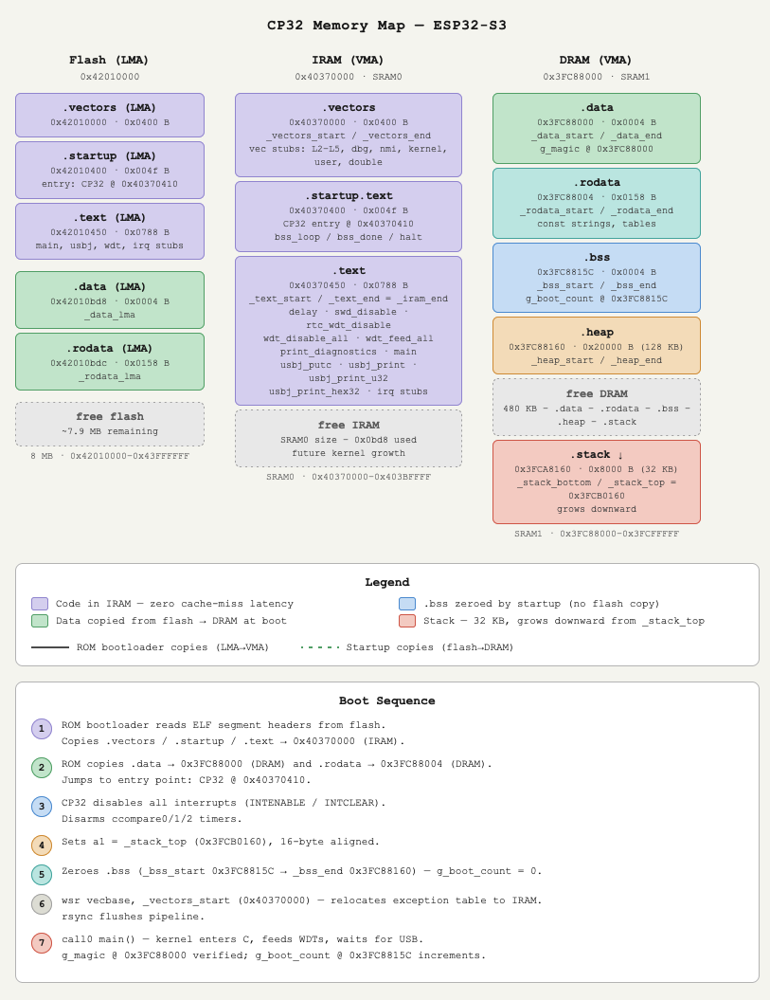

# CP32 Memory Map

This document tracks the current ELF layout for CP32 on ESP32-S3.

## Section layout

| Section | Size | VMA | LMA | Notes |
|---|---:|---:|---:|---|
| `.vectors` | `0x0400` | `0x40370000` | `0x42010000` | Vector table in IRAM |
| `.startup` | `0x004f` | `0x40370400` | `0x42010400` | Startup code in IRAM |
| `.text` | `0x0788` | `0x40370450` | `0x42010450` | Main code in IRAM |
| `.data` | `0x0004` | `0x3fc88000` | `0x42010bd8` | Initialized data in DRAM |
| `.rodata` | `0x0158` | `0x3fc88004` | `0x42010bdc` | Read-only data in DRAM |
| `.bss` | `0x0004` | `0x3fc8815c` | `-` | Zeroed at startup |
| `.heap` | `0x20000` | `0x3fc88160` | `-` | Heap reservation |
| `.stack` | `0x08000` | `0x3fca8160` | `-` | Stack reservation |

## Section summary

| Region | Start | End | Total | Notes |
|---|---:|---:|---:|---|
| IRAM | `0x40370000` | `0x40370bd8` | `0x0bd8` | `.vectors + .startup + .text` |
| DRAM data | `0x3fc88000` | `0x3fca8160` | `0x20160` | `.data + .rodata + .bss + .heap` |
| Stack | `0x3fca8160` | `0x3fcb0160` | `0x8000` | Reserved stack space |

## Program headers

| Segment | Offset | VMA | LMA | FileSiz | MemSiz | Flags | Notes |
|---|---:|---:|---:|---:|---:|---|---|
| 0 | `0x001000` | `0x40370000` | `0x42010000` | `0x0bd8` | `0x0bd8` | `R E` | IRAM code |
| 1 | `0x002000` | `0x3fc88000` | `0x42010bd8` | `0x015c` | `0x20160` | `RW` | Initialized data plus zeroed RAM |
| 2 | `0x000160` | `0x3fca8160` | `0x42010d40` | `0x0000` | `0x8000` | `RW` | Stack reservation |

## Symbol map

| Symbol | Address | Type | Notes |
|---|---:|---|---|
| `_data_start` | `0x3fc88000` | `D` | Start of `.data` |
| `_data_end` | `0x3fc88004` | `D` | End of `.data` |
| `_rodata_start` | `0x3fc88004` | `R` | Start of `.rodata` |
| `_rodata_end` | `0x3fc8815c` | `R` | End of `.rodata` |
| `_heap_start` | `0x3fc88160` | `B` | Start of heap |
| `_heap_end` | `0x3fca8160` | `B` | End of heap |
| `_stack_bottom` | `0x3fca8160` | `B` | Bottom of stack |
| `_stack_top` | `0x3fcb0160` | `B` | Top of stack |
| `_iram_vma` | `0x40370000` | `T` | IRAM base |
| `_vectors_start` | `0x40370000` | `T` | Start of vectors |
| `_vector_table_end` | `0x40370400` | `t` | End of vector table |
| `CP32` | `0x40370410` | `T` | Entry trampoline |

## Quick read

- The vector table now occupies `0x0400` bytes at `0x40370000`.
- The startup code begins at `0x40370400` and `.text` begins at `0x40370450`.
- `.data`, `.rodata`, `.bss`, `.heap`, and `.stack` are contiguous in DRAM.
- Flash load addresses are tightly packed, starting at `0x42010000`.
